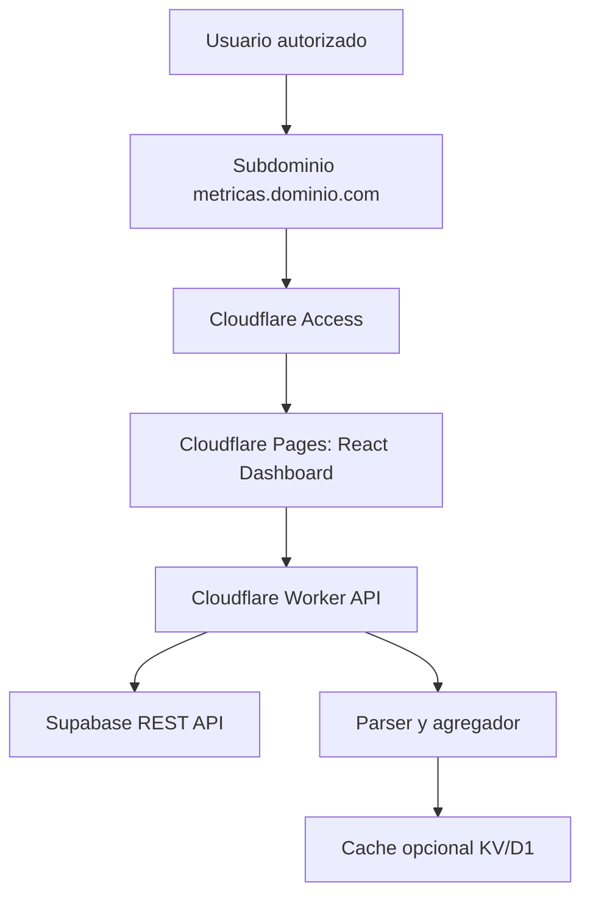
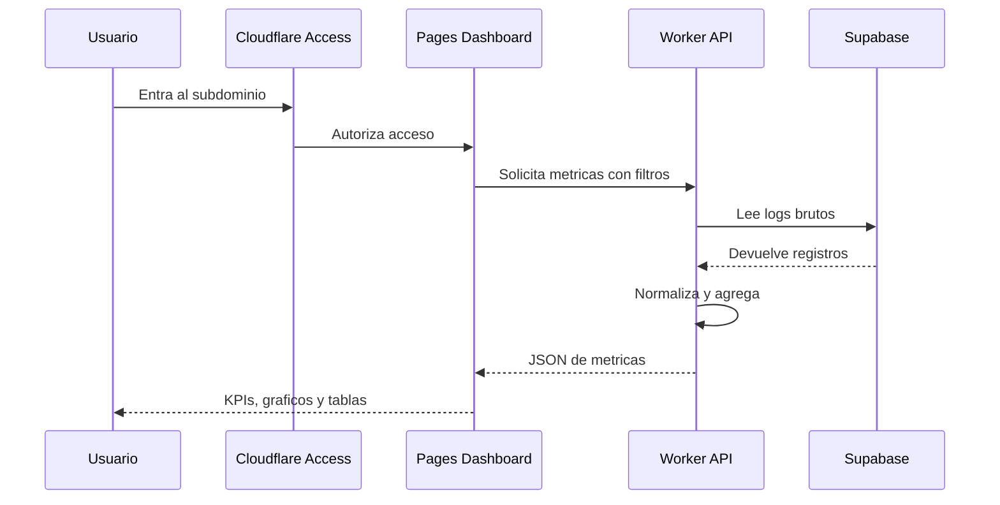

# Technical Architecture

## Arquitectura propuesta

La solucion recomendada de menor costo usa:

- Supabase como fuente de datos.
- Cloudflare Worker o Pages Functions como API segura.
- React + Vite como frontend del dashboard.
- Cloudflare Pages como hosting del dashboard.
- Cloudflare DNS para subdominio.
- Cloudflare Access como autenticacion recomendada.
- Cloudflare KV/D1 como cache opcional.



## Componentes

### 1. Supabase

Fuente principal de logs.

Tabla esperada:

```text
audit_log_entries
```

Campos esperados:

```text
id uuid
fecha_creacion timestamptz
session_id text
pregunta_usuario text
respuesta_ia text/json
tokens_usados integer
metadata text/json
error_log text
output text/html
```

### 2. Cloudflare Worker API

Responsabilidades:

- Proteger credenciales de Supabase.
- Leer registros brutos desde Supabase.
- Parsear JSON y HTML.
- Calcular metricas agregadas.
- Entregar datos al frontend en formato JSON.
- Aplicar cache para reducir lecturas repetidas.
- Exponer endpoints de salud, resumen, series temporales, rankings y logs.

### 3. React Dashboard

Responsabilidades:

- Mostrar KPIs gerenciales.
- Renderizar graficos y tablas.
- Gestionar filtros.
- Consumir API propia.
- Ser responsive en desktop, tablet y movil.
- Mostrar estados de carga, error y vacio.

### 4. Cloudflare Pages

Hosting del frontend.

Ventajas:

- Costo inicial 0 EUR.
- Subdominio propio facil.
- Deploy desde GitHub.
- Integracion con Cloudflare Access.

### 5. Cloudflare Access

Autenticacion recomendada para MVP.

Ventajas:

- Evita construir login propio.
- Permite limitar por emails autorizados.
- Reduce riesgo de seguridad.
- No expone el dashboard publicamente.

### 6. Cache opcional

Opciones:

| Opcion | Uso |
|---|---|
| Cache API del Worker | Cache simple de respuestas agregadas |
| Cloudflare KV | Guardar estado y metricas precomputadas |
| Cloudflare D1 | Guardar tabla analitica limpia si crece el volumen |
| Supabase tabla limpia | Mantener transformaciones dentro de Supabase |

## Flujo de uso



## Endpoints API recomendados

| Endpoint | Metodo | Uso |
|---|---|---|
| `/api/health` | GET | Estado de la API |
| `/api/summary` | GET | KPIs ejecutivos |
| `/api/timeseries` | GET | Consultas/tokens/errores por fecha |
| `/api/intents` | GET | Distribucion por intencion |
| `/api/top-companies` | GET | Empresas mas consultadas |
| `/api/top-categories` | GET | Categorias mas consultadas |
| `/api/locations` | GET | Ciudades y estados |
| `/api/quality` | GET | Ambiguedad, JSON invalido, datos faltantes |
| `/api/logs` | GET | Tabla paginada de registros limpios |
| `/api/export.csv` | GET | Exportacion CSV opcional |

## Parametros comunes de filtros

```text
from=YYYY-MM-DD
to=YYYY-MM-DD
intent=COMPANY
company=texto
category=texto
city=texto
state=texto
ambiguous=true|false
hasError=true|false
limit=100
offset=0
```

## Estrategia de calculo

### MVP

Calcular metricas bajo demanda desde Supabase con cache corto:

- cache de 5 a 15 minutos,
- filtros por fecha,
- maximo de filas por consulta,
- agregacion en Worker.

### Version escalable

Preprocesar logs en una tabla limpia:

```text
bot_metrics_clean
```

y consultar esa tabla desde la API.

## Decisiones tecnicas

| Decision | Recomendacion |
|---|---|
| Frontend | React + Vite |
| Graficos | Recharts o Apache ECharts |
| UI | CSS propio o Tailwind |
| API | Cloudflare Worker / Pages Functions |
| Fuente | Supabase REST API |
| Cache | Worker Cache, KV o D1 segun volumen |
| Estado ETL | KV, D1 o Supabase `etl_state` |
| Autenticacion | Cloudflare Access |
| Dashboard | Web propia en subdominio |

## Alternativas

### Alternativa A: Dashboard sin cache

Mas simple. Adecuado para pocos registros. Puede volverse lento si la tabla crece.

### Alternativa B: Dashboard con tabla limpia en Supabase

Buena opcion intermedia. El Worker escribe o actualiza `bot_metrics_clean`, y la API consulta datos limpios.

### Alternativa C: Dashboard con Cloudflare D1

Buena opcion si se quiere desacoplar analitica de Supabase y reducir consultas a la base original.

### Alternativa D: BI externo futuro

Looker Studio o BigQuery pueden incorporarse en el futuro, pero no forman parte del MVP.
