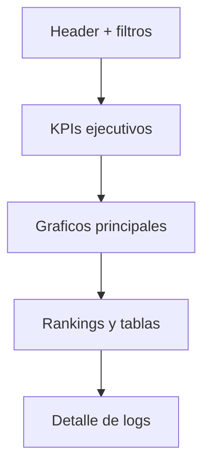

# Web Dashboard Spec

## Objetivo

Definir la experiencia visual y funcional del dashboard web propio que reemplaza el uso de Looker Studio.

## URL objetivo

Ejemplos:

```text
metricas.dominio.com
dashboard.dominio.com
analytics.dominio.com
```

## Principios de diseno

1. La primera pantalla debe ser el dashboard funcional, no una landing page.
2. Debe ser claro para gerencia y util para el equipo tecnico.
3. Debe cargar rapido.
4. Debe tener filtros globales visibles.
5. Debe evitar saturacion visual.
6. Debe funcionar bien en desktop y tablet.
7. En movil debe permitir revisar KPIs y rankings principales.

## Stack visual recomendado

| Area | Recomendacion |
|---|---|
| Frontend | React + Vite |
| Graficos | Recharts para MVP, Apache ECharts si se requiere mas potencia |
| Estilos | Tailwind o CSS modular |
| Iconos | Lucide |
| Tablas | TanStack Table opcional |
| Fechas | date-fns o utilidades nativas |

## Layout general



## Navegacion

Se recomienda sidebar o tabs superiores:

| Seccion | Ruta |
|---|---|
| Resumen | `/` |
| Demanda | `/demand` |
| Calidad | `/quality` |
| Directorio | `/directory` |
| Tecnico | `/technical` |
| Logs | `/logs` |

## Filtros globales

Disponibles en todas las pantallas:

| Filtro | Tipo |
|---|---|
| Rango de fechas | Date range picker |
| Intencion | Select multiopcion |
| Empresa | Buscador |
| Categoria | Select |
| Ciudad | Select |
| Estado | Select |
| Solo ambiguas | Toggle |
| Solo errores | Toggle |
| Con/sin web | Select |

## Pagina 1: Resumen

Objetivo: vista ejecutiva del uso y salud del bot.

### KPI cards

| KPI | API |
|---|---|
| Total de consultas | `/api/summary` |
| Sesiones unicas | `/api/summary` |
| Usuarios aproximados | `/api/summary` |
| Tokens totales | `/api/summary` |
| Tokens promedio | `/api/summary` |
| Tasa de ambiguedad | `/api/summary` |
| Tasa de error | `/api/summary` |
| Respuestas con web | `/api/summary` |

### Graficos

| Grafico | Tipo | API |
|---|---|---|
| Consultas por dia | Line chart | `/api/timeseries` |
| Consultas por hora | Bar chart | `/api/timeseries?groupBy=hour` |
| Intenciones | Donut/bar | `/api/intents` |
| Ambiguas vs directas | Stacked bar | `/api/quality` |

## Pagina 2: Demanda comercial

Objetivo: identificar interes comercial.

Componentes:

1. Top empresas consultadas.
2. Top categorias/sectores.
3. Busquedas con muchos resultados.
4. Ciudades y estados con mas actividad.
5. Tabla de preguntas mas repetidas.

KPIs:

- empresa mas consultada,
- categoria mas consultada,
- ciudad mas consultada,
- porcentaje de consultas por empresa.

## Pagina 3: Calidad del bot

Objetivo: detectar friccion y problemas de salida.

Componentes:

| Componente | Descripcion |
|---|---|
| Tasa de ambiguedad | Porcentaje de outputs con "Te refieres" |
| JSON invalido | Conteo y tendencia |
| Errores tecnicos | Conteo desde `error_log` |
| Resultados promedio | Promedio por busqueda |
| Consultas amplias | Filas con muchos resultados |

Alertas visuales:

| Condicion | Nivel |
|---|---|
| Ambiguedad > 50% | Advertencia |
| JSON invalido > 0 | Atencion tecnica |
| Error rate > 2% | Critico |
| Resultados promedio > 5 | Revisar precision |

## Pagina 4: Calidad del directorio

Objetivo: detectar datos incompletos en las empresas devueltas.

Componentes:

- Empresas sin web.
- Empresas sin telefono.
- Empresas sin RIF.
- Empresas sin ubicacion completa.
- Ranking de categorias incompletas.

## Pagina 5: Tecnico

Objetivo: monitoreo operativo.

Componentes:

- Tokens por dia.
- Tokens promedio por intencion.
- Consultas por modelo.
- Consultas por origen/referer.
- Usuarios aproximados por IP hash.
- Estado de cache.
- Version del parser.

## Pagina 6: Logs

Tabla filtrable y paginada.

Columnas:

| Columna |
|---|
| Fecha |
| Sesion |
| Pregunta |
| Intencion |
| Empresa detectada |
| Resultados |
| Ambigua |
| Error |
| Tokens |
| Web |
| Ciudad |
| Estado |

Acciones:

- Copiar pregunta.
- Ver detalle.
- Exportar CSV.

## Estados de interfaz

| Estado | Comportamiento |
|---|---|
| Loading | Skeletons en cards y charts |
| Error API | Mensaje claro + boton reintentar |
| Sin datos | Empty state con filtros actuales |
| Sin autorizacion | Pantalla de acceso denegado |
| Datos parciales | Mostrar warning no bloqueante |

## Diseno responsive

Desktop:

- Sidebar o tabs.
- Grid de KPIs 4 columnas.
- Graficos en 2 columnas.

Tablet:

- KPIs en 2 columnas.
- Graficos apilados.

Movil:

- KPIs en 1 columna.
- Rankings simplificados.
- Tabla de logs con vista de tarjetas.

## Exportaciones

MVP:

- Exportar CSV desde `/api/export.csv`.

Fase posterior:

- Exportar PDF de resumen.
- Programar envio de reporte por email.

## Criterios de aceptacion visual

1. El dashboard muestra KPIs en la primera pantalla.
2. Los filtros modifican todos los graficos.
3. Los graficos no se solapan en movil.
4. Las tablas tienen paginacion.
5. Los estados loading/error/empty estan implementados.
6. No se muestra HTML bruto al usuario.
7. No se expone IP real si se configura anonimizar.
